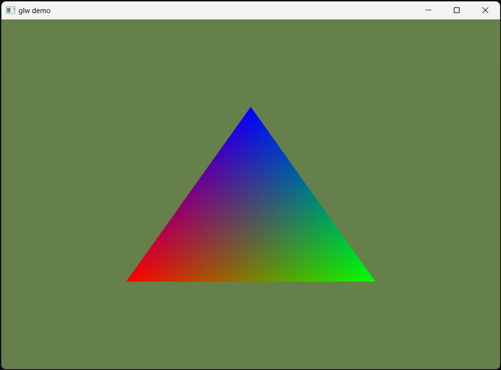
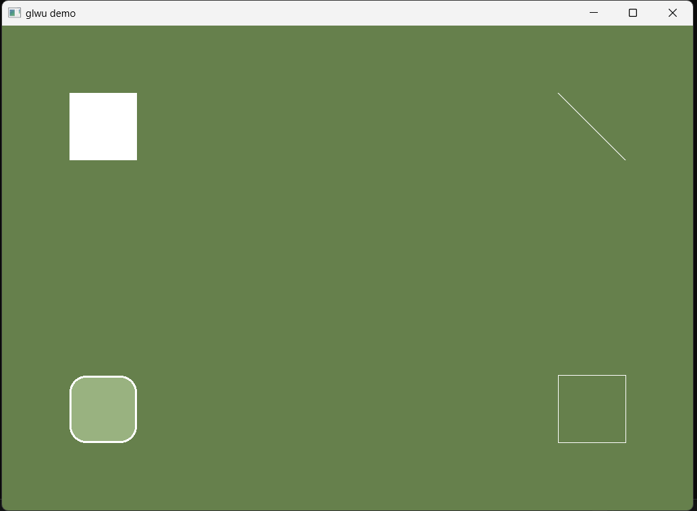

# glw
Unofficial OpenGL Wrapper with utility extension.  
- `glw.hpp` for basic OpenGL wrapping.  
- `glwu.hpp` for extended object-based 2D rendering.  

## Features
- glw
  - Enumerated OpenGL types & flags
  - Encapsulated OpenGL handle classes
    - Context
    - ErrorQueue
    - Window
    - Event
    - BufferData
    - VAO
    - VBO
    - EBO
    - FBO
    - RBO
    - Texture
    - Shader
    - Program
- glwu
  - 2D objects for rendering utility
    - Camera2D
    - Sprite
    - BlendedSprite
    - Line
    - LinedRect
    - ColorRect
    - RoundedColorRect

## Demo
- [glw_demo.cpp](demo/glw_demo.cpp)
- [glwu_demo.cpp](demo/glwu_demo.cpp)

## Screenshots
| glw demo  | glwu demo |
| ------------- | ------------- |
|   |  |

## Dependencies
- glw
  - C++ 17+
  - GLFW 3.4
  - GLAD (which supports GL 4.6)
- glwu
  - glw
  - glm
  - stb_image

## License
Distributed under MIT License.
